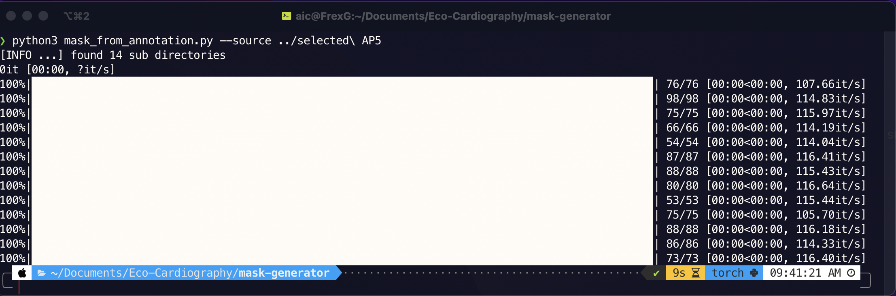

# LabelMe mask generetor CLA

Creates binary masks and corresponding csv labels for json annotations generated by labelme app.

## Usage
``` sh
python mask_from_annotation.py --source  'labelme-annotation-path'

```

## Requirements
    - python >3.x
    - glob2
    - numpy
    - opencv-python
    - pandas
    - argparse
    - tqdm 
